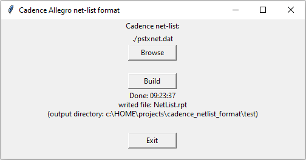

# Cadence Netlist Formatter

A Python CLI tool that transforms Cadence Allegro Netlist files (`.dat` format) into
human-readable reports. Simplify circuit analysis by converting complex Netlist data into an
organized, easy-to-read format.

## What It Does

Converts Cadence Allegro Netlist files into formatted reports showing nets with their connected
components:

**Input**: `pstxnet.dat` (Cadence Netlist format)

**Output**: `NetList.rpt` (human-readable report)

Example output:
```
...
+24V C7 2 L1 3 FU1 1 C19 2 Z6 1
CLK DD68 40 DD76 42
RESET X1 29 R64 1 R131 8
...
```

## Features

- **GUI-based file selection** - Simple tkinter interface
- **Smart config management** - Automatically saves your last file selection in the working directory (`.cnl_format.dat`)
- **Auto-versioning** - Preserves old reports (NetList.rpt → NetList.rpt,01 → NetList.rpt,02)
- **Cross-platform** - Works on Windows, macOS, and Linux
- **Modern Python** - Requires Python 3.10+ with modern language features

## Quick Start

1. **Install**: `pip install cadence_netlist_format`
2. **Run**: `cnl_format` (Cadence Net List Format)
3. **Format**: Select your netlist file and click "Format Netlist"



## Installation

### Prerequisites
- Python 3.10 or later
- tkinter (usually included with Python)

### Option 1: Install from Release

Download the latest [release](https://github.com/yuravg/cadence_netlist_format/releases) and install:

```bash
pip install cadence_netlist_format-<version>.whl
```

### Option 2: Build and Install from Source

```bash
# Clone the repository
git clone https://github.com/yuravg/cadence_netlist_format.git
cd cadence_netlist_format

# Build the package
make build

# Install
make install
```

Or manually:
```bash
pip install dist/cadence_netlist_format-<version>.whl
```

## Usage

### Running the Tool

Launch the GUI from any directory:

```bash
cnl_format
```

### Try the Examples

Test the tool with sample data:

```bash
cd examples/
cnl_format  # Pre-configured to load pstxnet_v3.dat
# Click "Format Netlist" to see it in action
```

## Development

For developers who want to contribute or modify the code:

### Build Commands
```bash
make build          # Build the wheel package
make install        # Install from built wheel
make pytest         # Run tests
make coverage       # Run tests with coverage report
```

### Development Setup
```bash
pip install -e ".[dev]"  # Install in editable mode with dev dependencies
```

### Testing
- Test data: `tests/data/inputs/` (sample netlists)
- Expected outputs: `tests/data/expected/` (reference files)
- Manual testing: Use the `examples/` directory

For detailed architecture and development guidelines, see `.claude/CLAUDE.md`.

## License

MIT License - See LICENSE file for details

## Repository

[https://github.com/yuravg/cadence_netlist_format](https://github.com/yuravg/cadence_netlist_format)
